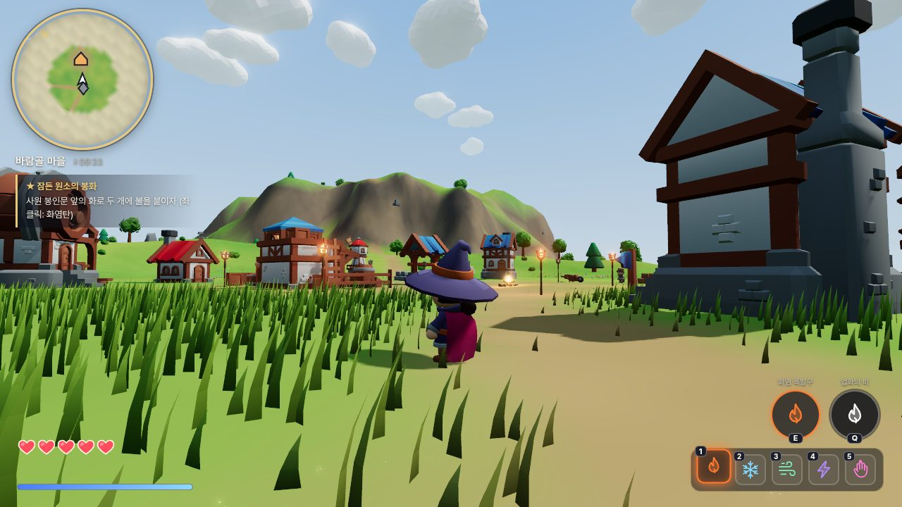
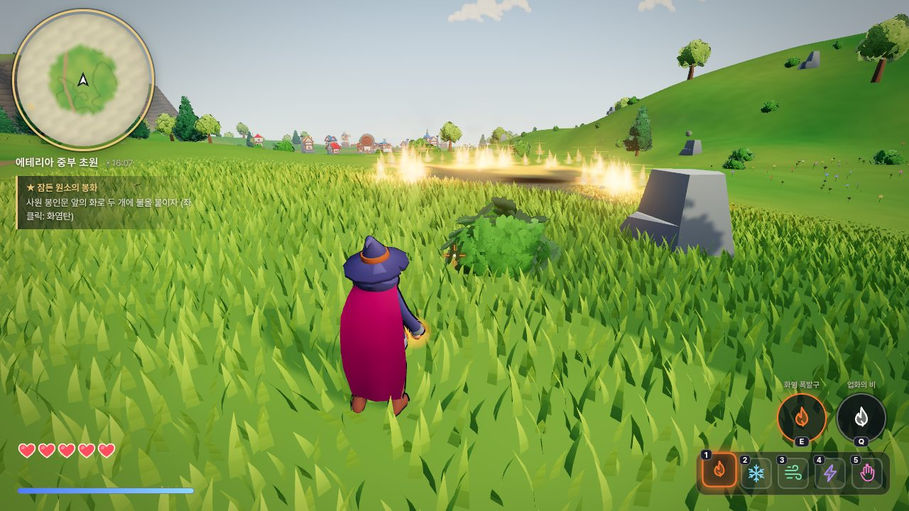
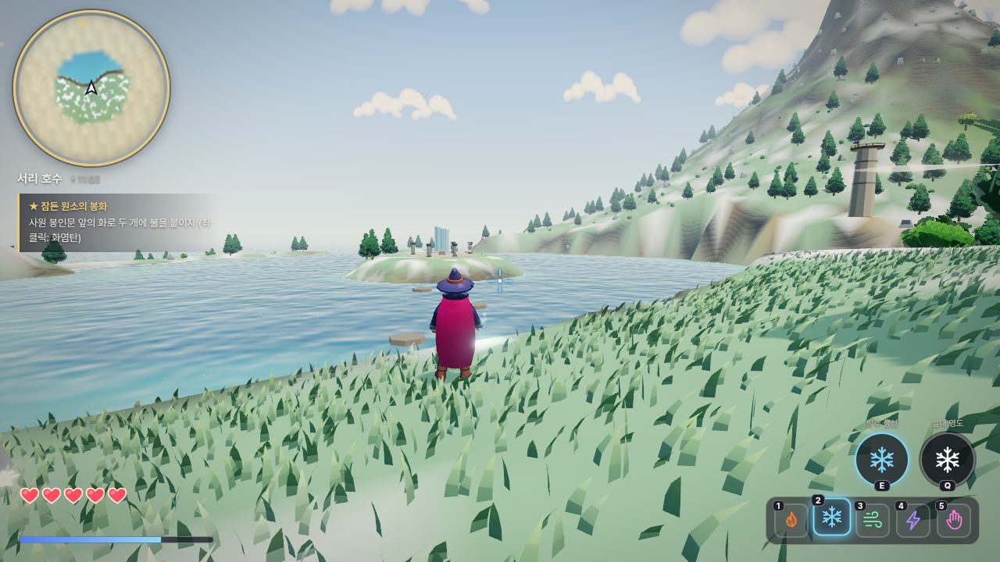
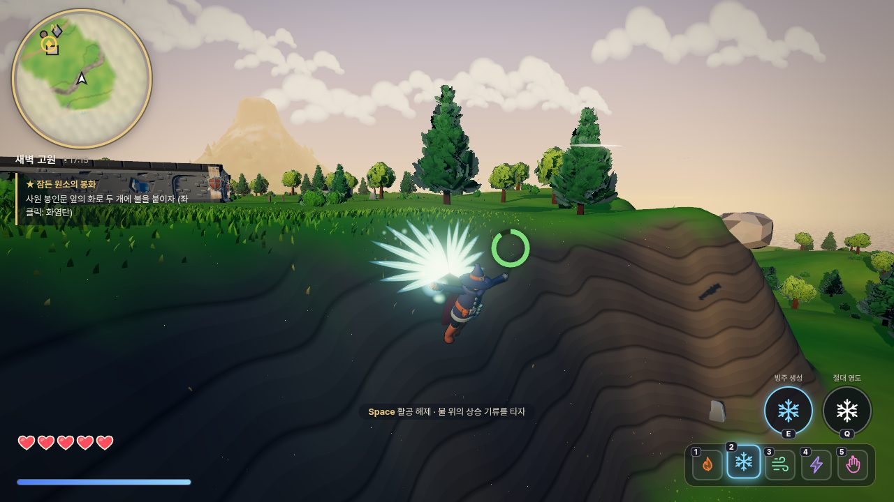
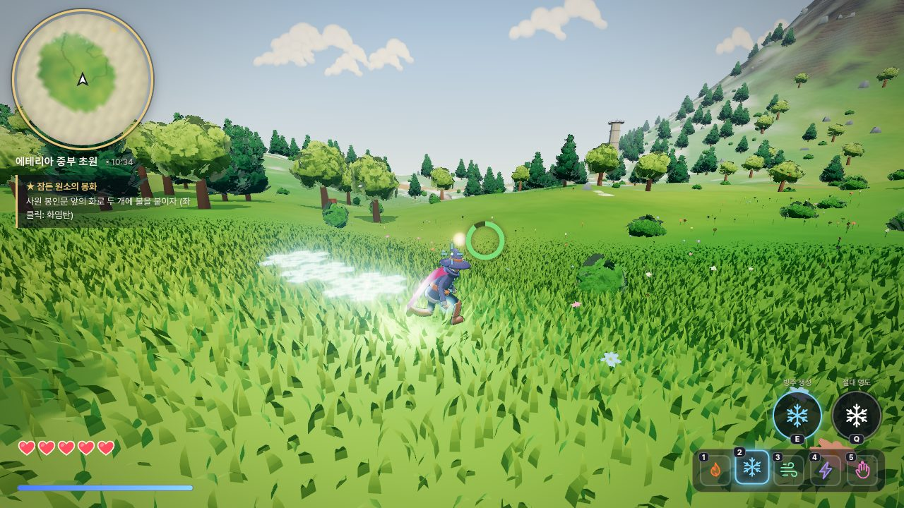
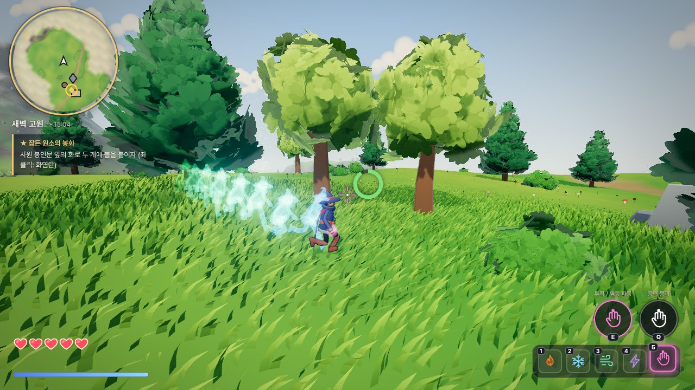

# 에테리아: 원소의 손 (Etheria: Hand of Elements)

젤다(야생의 숨결)·원신에서 영감을 받은 **브라우저용 3D 오픈월드 액션 어드벤처**입니다.
주인공은 커다란 지팡이 없이 **오른손에서 직접 원소 마법을 쏘는 마법사**이고,
세상의 거의 모든 것이 마법에 반응합니다.

| 바람골 마을 | 번지는 풀불 |
| --- | --- |
|  |  |
| **서리 호수** | **마력의 날개로 활공** |
|  |  |
| **빙결 질주 — 걸음마다 눈꽃** | **염동 질주 — 산데비스탄** |
|  |  |

## 실행 방법

```bash
npm install
npm run dev        # http://localhost:5173
npm run build      # dist/ 에 정적 빌드 (어떤 정적 호스팅에도 올릴 수 있음)
```

`?quality=low|medium|high` 로 그래픽 품질을, `?start=free` 로 타이틀을 건너뛰고 자유 모드를 바로 시작할 수 있습니다.

## 조작법

| 키 | 동작 |
| --- | --- |
| WASD | 이동 |
| Shift (한 번) | **달리기 고정** — 멈추면 해제, 기력 소모 없음 |
| Shift (3초 유지) | **원소 질주** — 선택한 원소의 힘으로 지면을 따라 고속 이동 (기력 소모) |
| Space | 점프 · **공중에서 한 번 더 누르면 활공** · 벽에서 도약 |
| C 또는 Alt | 회피 (무적 시간) |
| 마우스 · 휠 | 시점 회전 · 카메라 거리 (포트나이트식 **오른쪽 어깨 너머 3인칭**, 화면 중앙 조준선) |
| 우클릭(누른 채) | 정밀 조준: 카메라가 당겨지고 조준선 방향을 바라보며 옆걸음/뒷걸음 |
| 휠 클릭 / T | 적 주목(락온) |
| **좌클릭** | 오른손 기본 마법 |
| **E (누르고 있기)** | 원소 스킬 **충전** — 1초마다 1단계, 최대 3단계. 단계가 오를수록 범위·위력 증가 |
| **Q** | 원소 폭발 (적을 공격해 에너지를 모으면 사용) |
| 1~5 / R | 원소 선택: 화염 · 빙결 · 바람 · 번개 · 염동력 |
| F | 줍기 · 대화 · 열기 · 조사 |
| Tab / I · M · H · Esc | 가방 · 지도 · 빠른 회복 · 메뉴 |

벽이나 절벽에 대고 앞으로 가면 **기어오르고**, 깊은 물에서는 **헤엄칩니다** (모두 기력 소모).

## 오른손의 다섯 원소

| 원소 | 좌클릭 | E | Q | 세상과의 상호작용 |
| --- | --- | --- | --- | --- |
| 🔥 화염 | 화염탄 | 화염 폭발구 | 업화의 비 | 풀·나무·상자를 태움, 불은 **바람 방향으로 번짐**, 화로·모닥불·횃불 점화, 얼음 녹이기, **불타는 풀 위에 상승 기류** |
| ❄️ 빙결 | 서리 창 | 빙주 생성 | 절대 영도 | **물 위를 얼려 발판**, 빙주로 높은 곳 오르기, 불 끄기, 적 빙결 |
| 🌪️ 바람 | 돌풍 | **폭풍 파동** (주변 전체를 거세게 밀쳐냄) | 대선풍 | 물체·적 밀쳐내기, **풍차 돌리기**, 불길 밀기/끄기, 적 화살 날려버리기, 풀이 파도처럼 눕기 |
| ⚡ 번개 | 전격(연쇄) | 낙뢰 | 뇌신의 심판 | 번개 수정 활성화, 물·젖은 적 감전, 금 간 바위 파괴, 폭발 통 점화 |
| ✋ 염동력 | 붙잡기/놓기 | 던지기 · 염동 파동 | 중력 붕괴 | 상자·바위·룬 블록 운반, **발판 퍼즐**, 던져서 공격, 정령석 들추기 |

### 원소 질주 (Shift 3초 유지)

| 원소 | 모습 | 상호작용 |
| --- | --- | --- |
| 🔥 화염 | 발에서 불꽃을 뿜으며 지면을 활주 | 지나간 자리의 풀이 잠깐 그을리고, 스친 적이 불탐 |
| ❄️ 빙결 | 걸음마다 프랙탈 눈꽃 결정이 피어남 | 앞의 물을 얼리며 호수 위를 달림, 스친 적 냉기 |
| 🌪️ 바람 | 휘감는 바람을 타고 미끄러짐 | 물 위도 미끄러져 건넘, 상자·적을 밀어냄, 불길을 밀어 번지게 함 |
| ⚡ 번개 | 몸에 번개를 두르고 질주 (가장 빠름) | 스친 적 감전 |
| ✋ 염동력 | 산데비스탄처럼 세상이 느려지고 잔상을 남김 | 주변 적·화면이 슬로모션 |

### E 스킬 충전 단계

| 원소 | 1단계 | 2단계 | 3단계 |
| --- | --- | --- | --- |
| 🔥 | 화염 폭발구 | 더 큰 폭발 | 착탄 지점에 불의 고리 |
| ❄️ | 빙주 | 더 높은 빙주 + 서리 파동 | 거대 빙주 + 주변 적 빙결 |
| 🌪️ | 폭풍 파동 (반경 8m) | 반경 12m, 더 세게 | 반경 16m, 적을 띄워 날려버림 |
| ⚡ | 낙뢰 | 더 넓은 낙뢰 | 낙뢰 4연발 |
| ✋ | 염동 파동 / 투척 | 더 넓게 / 더 세게 | 최대 범위 / 최대 속도 |

적에게는 원신식 **원소 반응**(융해·증발·빙결·감전·과부하·확산·초전도·파쇄)이 적용됩니다.
비가 오면 모두 젖어 번개에 약해지고, 불은 잘 번지지 않습니다.

## 세계

- 1km² 크기의 섬: 새벽 고원, 바람골 마을, 바람의 평원, 속삭임의 숲, 서리 호수, 뇌운산, 동쪽 바람 절벽, 원소의 제단
- **메인 퀘스트**: 네 원소의 사당에서 새 마법을 얻고 시련을 풀어 봉화를 밝힌 뒤 해골 군주(원소 방패 보스) 처치
- 관측탑(지도 공개), 텔레포트 지점(빠른 이동), 여신상(정령의 씨앗 3개 → 하트/기력 증가)
- **바람 구멍**: 땅에서 바람이 솟구치는 곳. 뛰어들어 활공하면 높이 날아오른다 (바람의 사당을 풀면 하나 더 열림)
- 해골 야영지 7곳(모두 쓰러뜨리면 보물상자 열림), 화로 퍼즐, 금 간 바위, 바리케이드, 얼음벽 속 보물
- 숨은 정령의 씨앗: 들어 올리는 정령석, 도망치는 빛(마법으로 맞히기), 높은 곳
- 마을 NPC 의뢰(농부·아이·대장장이), 상인, 모닥불 요리, 낮·밤 순환, 비·뇌우 날씨
- 자동 저장 / 이어하기, 설정(품질·감도·볼륨)

## 기술

- **Three.js** 렌더링 + **Rapier** 물리(캐릭터 컨트롤러, 높이맵 지형, 동적 소품)
- 절차적 섬 지형(LOD 청크) · GPU 풀(불탄 칸은 텍스처 마스크로 즉시 사라지고 다시 자람) · 물/하늘 셰이더
- 셀 오토마타 화재 시뮬레이션(2m 격자, 바람 영향, 상승 기류, 칸마다 확산 에너지가 줄어들어 몇 미터 번지다 꺼짐)
- 불꽃 혀 모양 파티클 셰이더 · 타는 땅의 잔불 발광 · 충격파/돔/섬광/그을음 자국/얼음 가시 이펙트 · 강한 타격 시 히트스톱
- 흘러가는 구름 그림자 · 부드러운 푸른 그림자 · 지평선 헤이즈 · 들판을 훑는 바람 물결
- 상·하체 분리 애니메이션 블렌딩으로 달리면서 오른손 시전
- **6등신 리타기팅**: 2등신 KayKit 캐릭터를 로드 시 뼈대 축 방향으로 다시 구워(버텍스·바인드 행렬 재계산) 링크 같은 비율로 변환, 공용 애니메이션 트랙도 함께 보정
- **툰 셰이딩**(2단 명암 + 림 라이트) · 캐릭터 외곽선 · 잎 카드 방식의 폭신한 나무 · 그림 같은 구름 · 대기 원근(헤이즈) · 색 보정
- 절차적 포즈 레이어(벽 타기·활공·질주 자세, 팔 자연스럽게 내리기)
- 임베디드 PNG 텍스처를 직접 디코딩(엄격한 CSP 환경에서도 텍스처가 하얗게 나오지 않음)
- WebAudio 절차적 효과음·환경음·생성형 배경음악

에셋 출처는 [CREDITS.md](CREDITS.md)를 참고하세요.
